# API Flow Diagrams

## 1. Login Authentication Flow

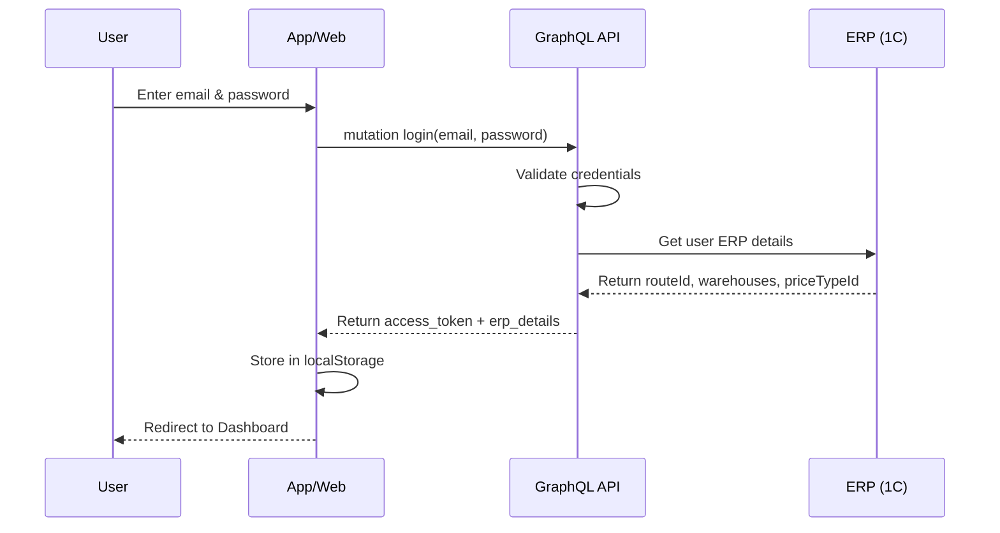

## 2. Products Fetch Flow

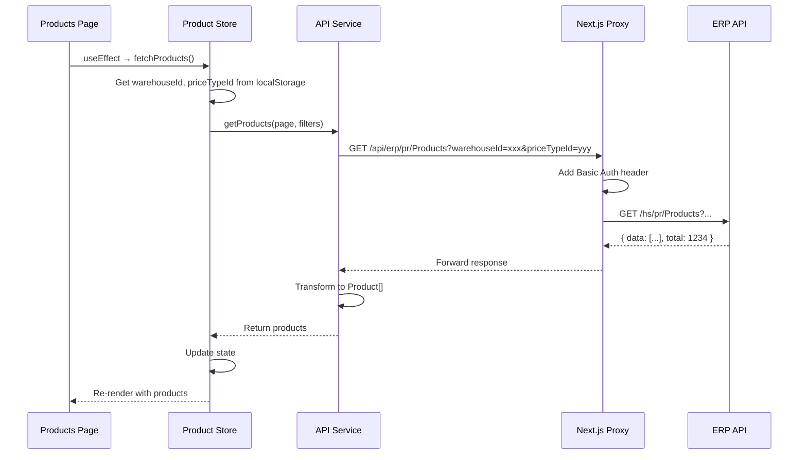

## 3. Partners Fetch Flow

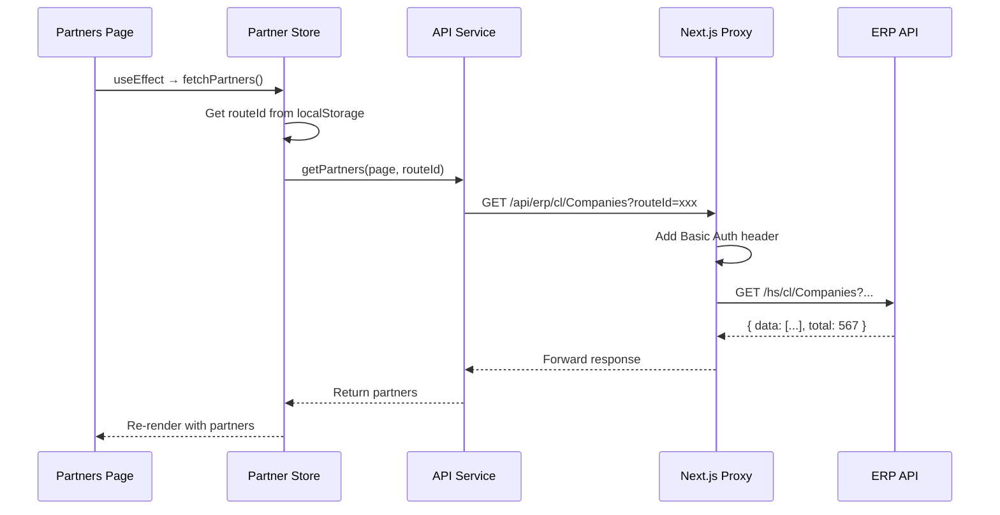

## 4. Order Creation Flow (Future)

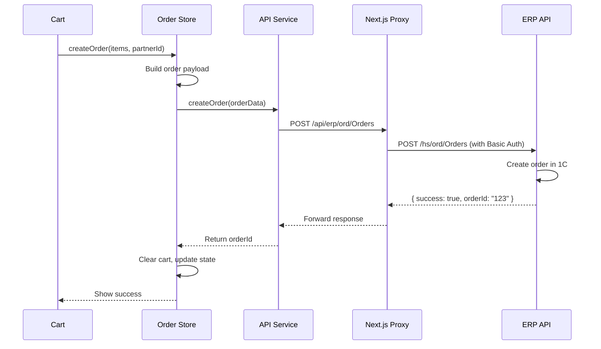

## 5. Token Refresh Flow

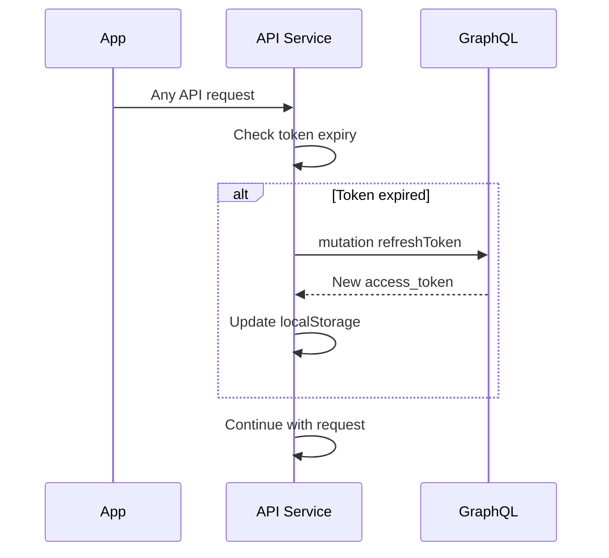

## 6. Logout Flow

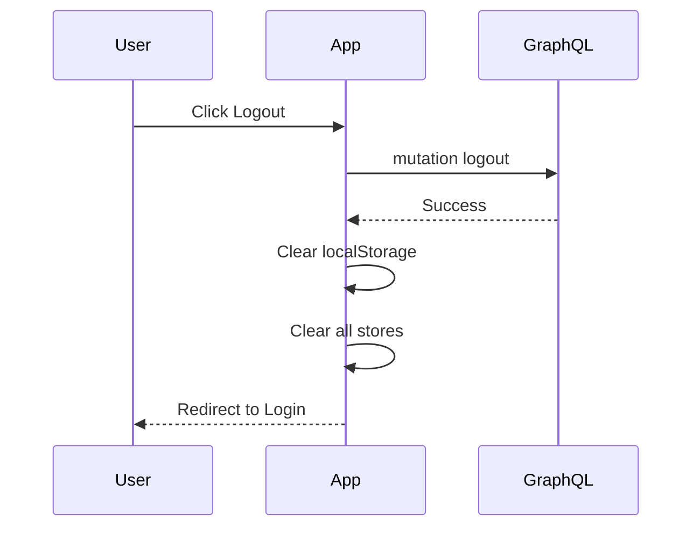

---

## State Management Flow

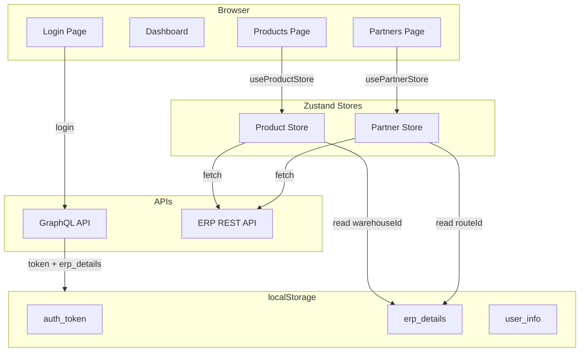

---

## Error Handling Flow

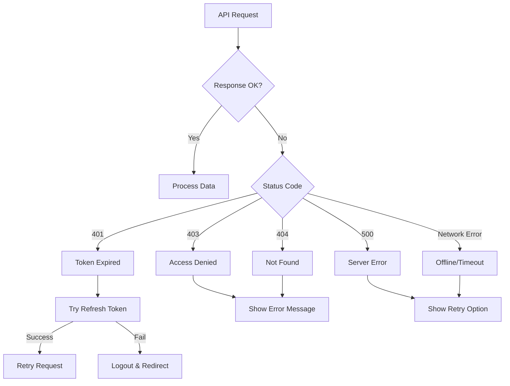

---

## Data Transformation Flow

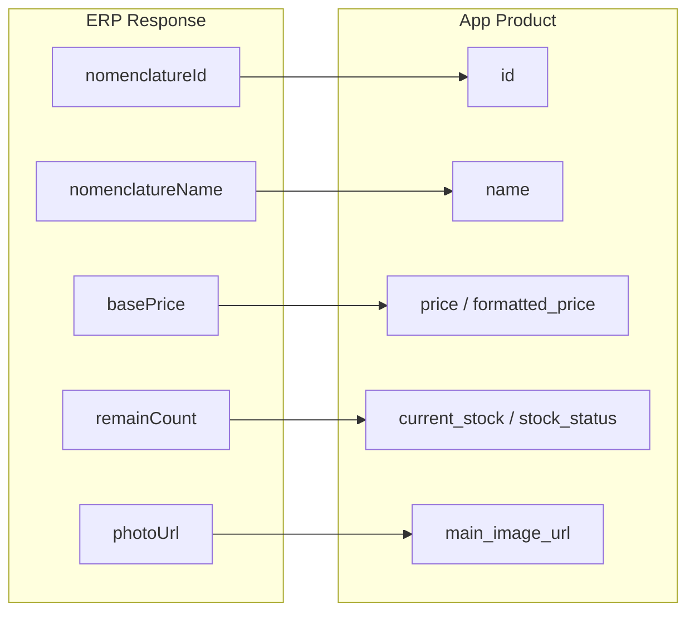

### Transformation Code

```typescript
function transformProduct(erpProduct: ERPProduct): Product {
  const stock = erpProduct.remainCount ?? 0;
  
  return {
    id: erpProduct.nomenclatureId,
    name: erpProduct.nomenclatureName,
    article: erpProduct.nomenclatureCode,
    price: erpProduct.basePrice,
    formatted_price: formatMNT(erpProduct.basePrice),
    current_stock: stock,
    stock_status: getStockStatus(stock),
    main_image_url: erpProduct.photoUrl || null,
    category: erpProduct.categoryName,
    category_id: erpProduct.categoryId,
  };
}
```

---

## Component Lifecycle

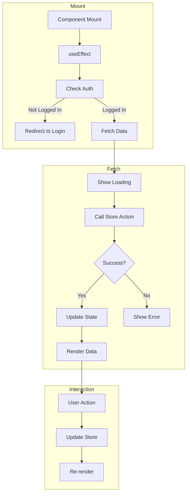

---

## File Dependencies

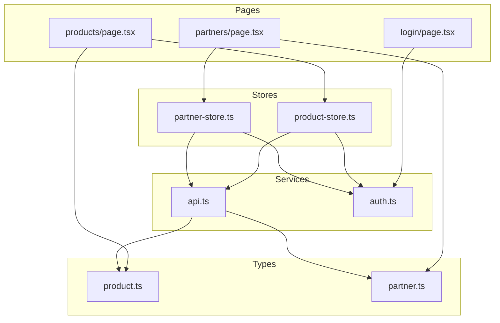

---

*These diagrams can be rendered using Mermaid-compatible viewers like GitHub, VS Code with Mermaid extension, or mermaid.live*
